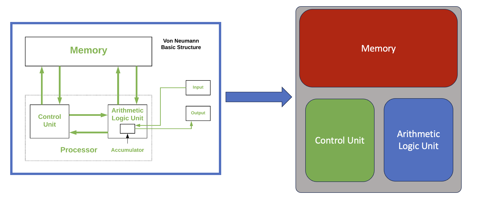
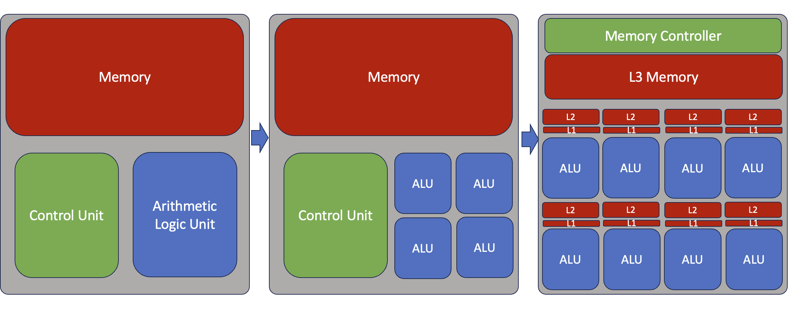
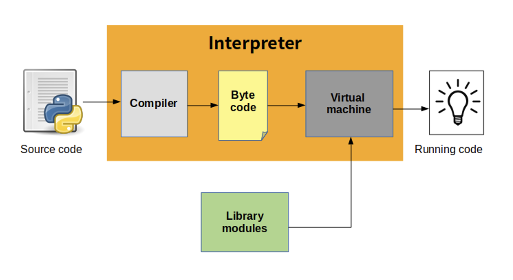
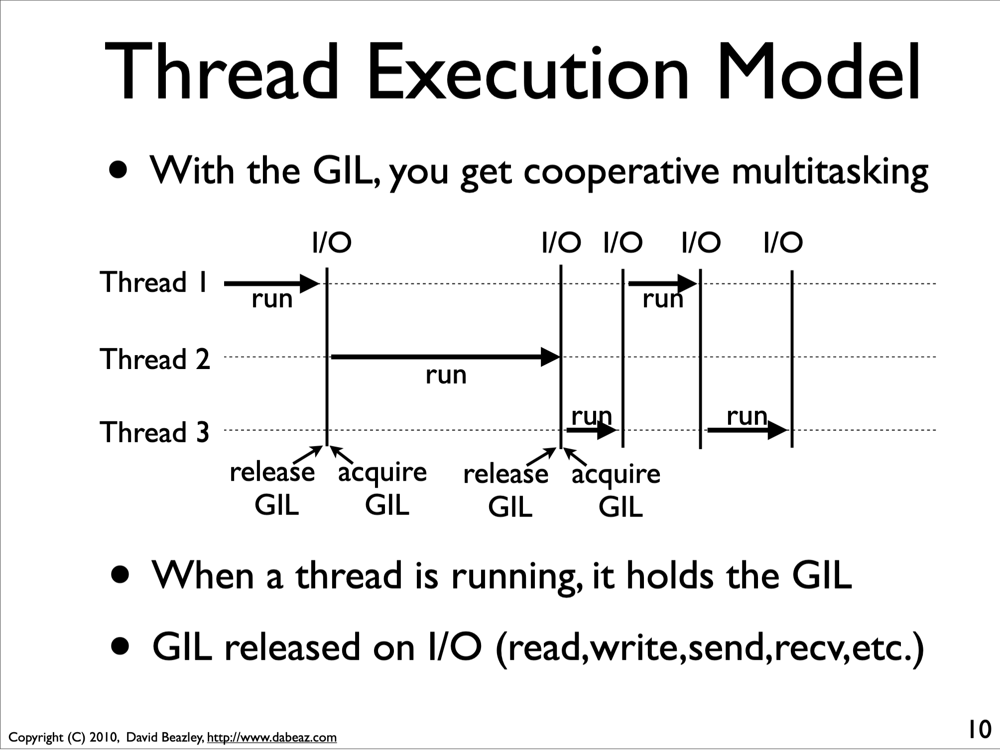
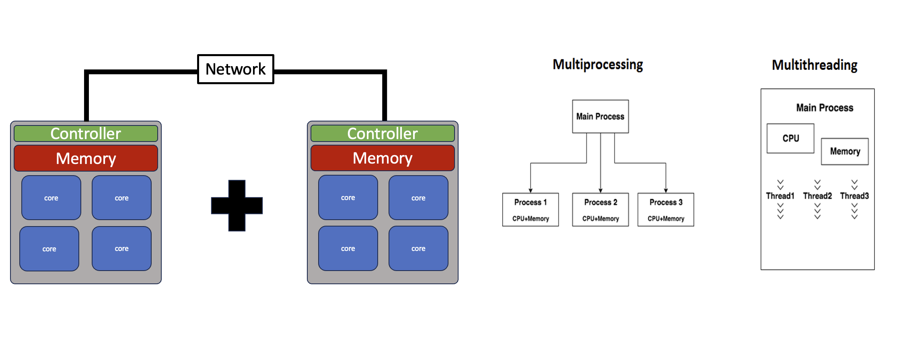
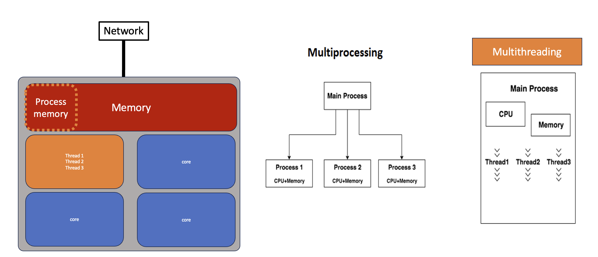
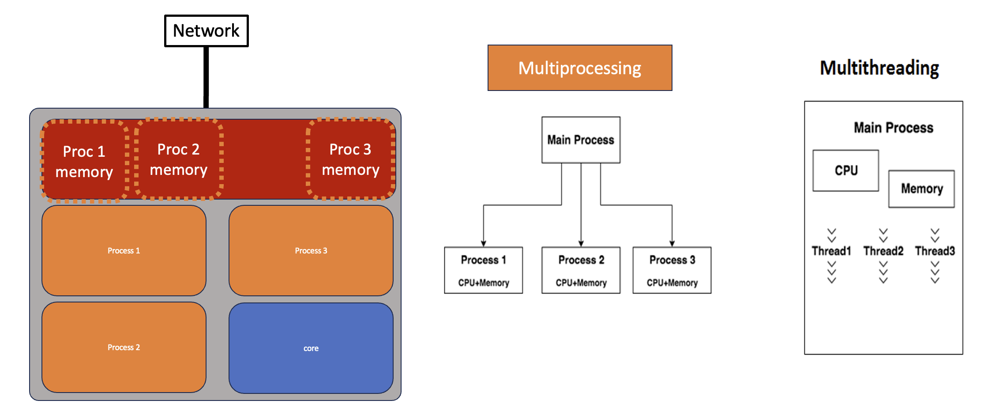

:::questions
- What is the Global Interpreter Lock (GIL)?
- How do I use multiple threads in Python?
:::

:::objectives
- Understand the basics of computer architecture.
- Understand the GIL.
- Understand the difference between `threads` and `processes` in Python. Specifically how to manage these with the `concurrent.futures` library.
:::

# A bit of computer architecture
### The von Neumann architecture
{alt="diagram with arrows"}

- A processing unit with both an arithmetic logic unit and processor registers
- A control unit that includes an instruction register and a program counter
- Memory that stores data and instructions
- External mass storage
- Input and output mechanisms

### Simple multi-core cpu architecture
{alt="diagram transition from cpu, multicore to gpu"}

:::challenge
## Challenge: How many logical cores (CPU cores) is located on the machine that you are running on?

Use the simple linux command `lscpu` to inspect the specifications of the compute architecture that you are running on.

To make things a bit more complicated.... Because this class is taught on shared resources, how many cores are actually allocated to this specific notebook instance that you are running on? HINT: use the linux tool `numactl` (specifically `numactl --show`).

::::solution
```
!lscpu
```
```
!numactl --show
```
::::
:::

# The Python Interpreter

{alt="schematic of python interpetrer"}

- Python source code is compiled into bytecode, the internal representation of a Python program in the interpreter.
- The bytecode is also cached in .pyc and .pyo files so that executing the same file is faster the second time (recompilation from source to bytecode can be avoided).
- This “intermediate language” is said to run on a virtual machine that executes the machine code corresponding to each bytecode.


## The Global Interpreter Lock

The Global Interpreter Lock (GIL) is an infamous feature of the Python interpreter. In CPython, theGIL, is a mutex that protects access to Python objects, preventing multiple threads from executing Python bytecodes at once. The GIL prevents race conditions and ensures thread safety, making programming in Python safer, and prevents us from using multiple cores from a single Python instance.

{alt="sequence diagram of python threads"}

When we want to perform parallel computations, this becomes an obvious problem.
There are roughly two classes of solutions to circumvent/lift the GIL:

- Run multiple Python instances: `multiprocessing`
- Have important code outside Python: OS operations, C++ extensions, cython, numba


# Threads, Processes and Python

There are two basic implementations of parallelism in the Python Standard Library. Parallelism implemented namely via "threads" or "processes"

{alt="parallelism in python"}


## Thread example (via threading)

{alt="diagram of forms of parallism"}

The [threading](https://docs.python.org/3/library/threading.html) module - includes a high-level, object oriented, API for working with concurrency from Python. **Thread objects run concurrently within the same process and share memory with other thread objects**. Using threads is an easy way to scale for tasks that are more I/O bound than CPU bound. The python threading module is used to manage the execution of threads within a process. It allows a program to run multiple operations concurrently in the same process space.

```python
t1 = Thread(target=some_worker_func, args=(rnd1, ))
```

Using threading to speed up your code:

```python
import threading
import os
import time

def worker(worker_id):
    """thread worker function"""
    time.sleep(worker_id)
    print('Worker:',worker_id)

```

```python
t1 = threading.Thread(target=worker, args=[1])
t2 = threading.Thread(target=worker, args=[2])

t1.start()
t2.start()

t1.join()
t2.join()
```

- The `.start()` method Starts the thread’s activity.
    - It must be called at most once per thread object. It arranges for the object’s run() method to be invoked in a separate thread of control.
    - This method will raise a RuntimeError if called more than once on the same thread object.
- The `.join()` method waits until the thread terminates.
    - This blocks the calling thread until the thread whose join() method is called terminates – either normally or through an unhandled exception – or until the optional timeout occurs.


:::challenge
### Basic Exercises: Try to use the simple functionality of the threading module.

1. Write a simple multi-threaded program that prints out the process id, thread id, and thread names. Usefull methods to use `threading.current_thread().name` and `threading.current_thread().native_id`.
2. Enumerating over all active threads. Usefull method `threading.enumerate()`. Question, How many active threads are behind the Jupyter Notebook?

::::solution
```python
import threading
import os
import time

def worker(worker_id):
    """worker function"""
    time.sleep(worker_id)

    print("Thread name:",threading.current_thread().name)
    print("Thread id:",threading.current_thread().native_id)
    print('Worker:',worker_id)
    print("PID:",os.getpid())

    print("The number of active threads is:", len(threading.enumerate()))
    print("And they are:",threading.enumerate())

    print("\n")
    print("\n")

t1 = threading.Thread(target=worker, args=[1])
t2 = threading.Thread(target=worker, args=[3])

t1.start()
t2.start()

t1.join()
t2.join()
```
::::
:::


## Process example (via multiprocessing)

{alt="diagram with coloured boxes"}

The [multiprocessing](https://docs.python.org/3/library/multiprocessing.html) - module mirrors threading, except that instead of a Thread class it provides a Process. Each Process is a true system process without shared memory, but multiprocessing provides features for sharing data and passing messages between them so that in many cases converting from threads to processes is as simple as changing a few import statements.

Multiprocessing is a package that supports spawning processes using an API similar to the threading module. The multiprocessing package offers both local and remote concurrency, effectively side-stepping the Global Interpreter Lock by using subprocesses instead of threads. Due to this, the multiprocessing module allows the programmer to fully leverage multiple processors on a given machine. It runs on both Unix and Windows.

The multiprocessing module also introduces APIs which do not have analogs in the threading module. A prime example of this is the Pool object which offers a convenient means of parallelizing the execution of a function across multiple input values, distributing the input data across processes (data parallelism). The following example demonstrates the common practice of defining such functions in a module so that child processes can successfully import that module.


```python
p1 = Process(target=some_worker_func, args=(n,))
```

:::challenge
### Basic Exercises: Try to use the simple functionality of the multiprocessing module.
1. Now re-write the code that prints out the process id, thread id, and thread names but with `multiprocessing`. What are the differences?


::::solution
```python
import threading
import multiprocessing
import os
import time

def worker(worker_id):
    """worker function"""
    time.sleep(worker_id)

    print("Thread name:",threading.current_thread().name)
    print("Thread id:",threading.current_thread().native_id)
    print('Worker:',worker_id)
    print("PID:",os.getpid())

    print("The number of active threads is:", len(threading.enumerate()))
    print("And they are:",threading.enumerate())


p1 = multiprocessing.Process(target=worker, args=[1])
p2 = multiprocessing.Process(target=worker, args=[2])

p1.start()
p2.start()

p1.join()
p2.join()
```
::::

:::


# Concurrent Futures (easy solution for Threads/Processes)
Now that we have introduced the concepts of **Threads** and **Processes** in Python. Lets step back and use the [concurrent.futures](https://docs.python.org/3/library/concurrent.futures.html) module. This module provides interfaces for running tasks using pools of thread or process workers. The APIs are the same, so applications can switch between threads and processes with minimal changes.

The module provides two types of classes for interacting with the pools.

- **Executors** are used for managing pools of workers.
- **Futures** are used for managing results computed by the workers.

To use a pool of workers, an application creates an instance of the appropriate executor class and then submits tasks for it to run. When each task is started, a Future instance is returned.


## ThreadPoolExecutor, ProcessPoolExecutor

ThreadPoolExecutor is an Executor subclass that uses a pool of threads to execute calls asynchronously. ThreadPoolExecutor manages a set of worker threads, passing tasks to them as they become available for more work.

This example uses map() to concurrently produce a set of results from an input iterable. The task uses time.sleep() to pause a different amount of time to demonstrate that, regardless of the order of execution of concurrent tasks, map() always returns the values in order based on the inputs.

```python
tasks = range(1,5)

ex = futures.ThreadPoolExecutor(max_workers=len(tasks))

results = ex.map(some_worker_func, tasks)
```

:::challenge
## Exercise: adapt the original exercise to submit tasks to a pool
- Try launching a pool of threads vs processes

::::solution
```python
import threading
from concurrent import futures
import os
import time

def worker(worker_id):
    """worker function"""
    time.sleep(worker_id)

    print("Worker:", worker_id)
    print("PID:",os.getpid())
    print("Thread name:",threading.current_thread().name)
    print("Thread id:",threading.current_thread().native_id)

    print("The number of active threads is:", len(threading.enumerate()))
    print("And they are:",threading.enumerate())


tasks = range(1,5)
ex = futures.ThreadPoolExecutor(max_workers=len(tasks))
results = ex.map(worker, tasks)
```
::::
:::

:::callout
## Protect process creation with an `if`-block
A module should be safely importable.  Any code that creates
processes, pools, or managers should be protected with:
```python
if __name__ == "__main__":
    ...
```
:::

:::challenge
##  Exercise: Write calc_pi to be caculated using the .map() method.
- Try launching a pool of threads vs processes.
- Whats the speed up? Are there benefits with Threads v Processes?

::::solution

```python
import time
import random
import numpy as np
from concurrent import futures

def calc_pi_map(N):
    M = 0
    for i in range(N):
        # Simulate impact coordinates
        x = random.uniform(-1, 1)
        y = random.uniform(-1, 1)

        # True if impact happens inside the circle
        if x**2 + y**2 < 1.0:
            M += 1
    return 4 * M

resolution = 10**6
num_workers = 2

p_start = time.time()

ex = futures.ThreadPoolExecutor(max_workers=num_workers)
# or
# ex = futures.ProcessPoolExecutor(max_workers=num_workers)
results = ex.map(calc_pi_map, [resolution for x in range(num_workers)])
final_results = list(results)

p_end = time.time()

print("Resultion:", np.mean(final_results)/resolution - np.pi)
print("Execution:", p_end - p_start)
```
::::
:::

:::discussion
### Discussion: where's the speed-up threads vs processes?
While mileage may vary, parallelizing `calc_pi`, `calc_pi_numpy` and `calc_pi_numba` this way will
not give the expected speed-up. `calc_pi_numba` should give *some* speed-up, but nowhere near the
ideal scaling over the number of cores. This is because Python only allows one thread to access the
interperter at any given time, a feature also known as the Global Interpreter Lock.
:::

### The GIL in action

The downside of running multiple Python instances is that we need to share program state between different processes.
To this end, you need to serialize objects. Serialization entails converting a Python object into a stream of bytes,
that can then be sent to the other process, or e.g. stored to disk. This is typically done using `pickle`, `json`, or
similar, and creates a large overhead.
The alternative is to bring parts of our code outside Python.
Numpy has many routines that are largely situated outside of the GIL.
The only way to know for sure is trying out and profiling your application.

To write your own routines that do not live under the GIL there are several options: fortunately `numba` makes this very easy.


:::keypoints
- If we want the most efficient parallelism on a single machine, we need to circumvent the GIL.
- If your code releases the GIL, threading will be more efficient than multiprocessing.
- If your code does not release the GIL, some of your code is still in Python, and you're wasting precious compute time!
:::
